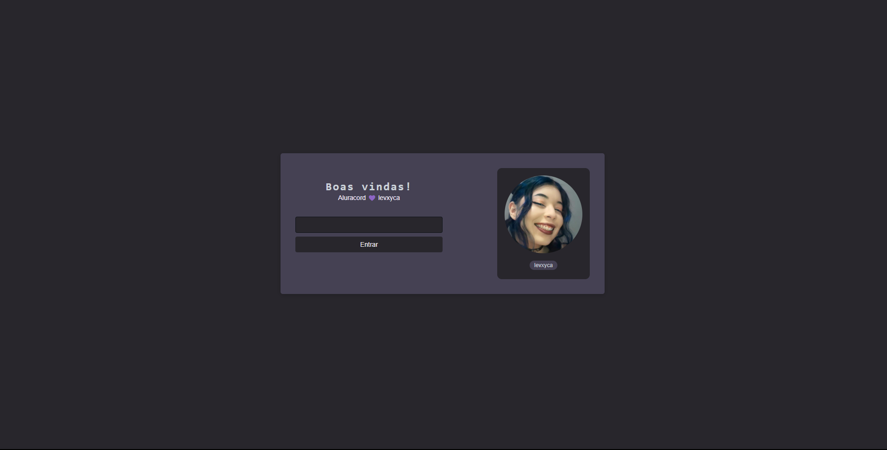

# Aluracord - Imersão React ⭐

> 📖 Desenvolvido durante a Imersão React da Alura.

## 🖱️ Desafios a serem implementados

- [ x ] Customizar o Aluracord;
- [ x ] Validação de campo para mostrar a imagem apenas se o usuário tiver mais de 2 caracteres;
- [   ] Consumir outras informações da API do GitHub;
- [   ] Criar uma página 404.js na pasta de pages;
- [   ] Inserir um botão de OK para enviar as mensagens;
- [   ] Inserir um botão de apagar mensagem;
- [   ] Mostrar o loading de mensagens;
- [   ] Criar um efeito de hover nas mensagens;

Feito com 💜 por [levxyca](https://levxyca.com/)